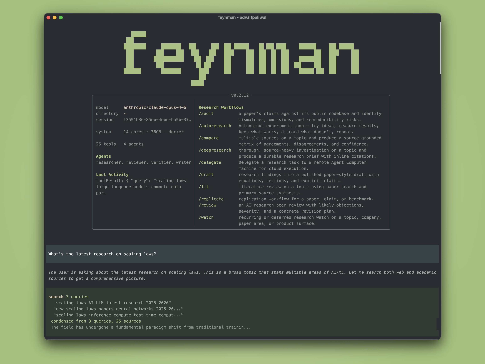

<p align="center">
  <a href="https://github.com/NoWint/Nervefeyn">
    
  </a>
</p>
<p align="center">开源 AI 研究代理 — 神经计算研究工作台。基于 Pi 运行时,内置论文搜索、文献综述、多代理深度调查、有界实验循环与长线自主研究。</p>
<p align="center">
  <a href="https://github.com/NoWint/Nervefeyn"></a>
  <a href="https://github.com/NoWint/Nervefeyn/blob/main/LICENSE"></a>
</p>
<p align="center">
  Fork 自 <a href="https://github.com/companion-inc/feynman">companion-inc/feynman</a> · 原作者 <a href="https://github.com/companion-inc">Companion, Inc.</a>(MIT)· 本 fork 采用 GPLv3
</p>

---

### 快速开始

需要 Node.js >= 20。clone 后执行 `prepare-runtime-workspace.mjs` 准备 Pi 运行时(下载 Pi 包并打补丁),然后 `npm run dev` 启动。

**macOS / Linux:**

```bash
git clone https://github.com/NoWint/Nervefeyn.git
cd Nervefeyn
npm install
node scripts/prepare-runtime-workspace.mjs
npm run dev
```

**Windows (PowerShell):**

```powershell
git clone https://github.com/NoWint/Nervefeyn.git
cd Nervefeyn
npm install
node scripts/prepare-runtime-workspace.mjs
npm run dev
```

本地模型可通过 setup 流程接入:启动后运行 `/feynman-model` 或 `npm run dev -- setup`,选择 provider(LM Studio 默认 `http://localhost:1234/v1`,LiteLLM 默认 `http://localhost:4000/v1`,Ollama/vLLM 用 Custom provider 指向本地 `/v1` endpoint)。

---

### 你输入什么 → 会发生什么

```
$ nervefeyn "what do we know about scaling laws"
→ 搜索论文与网页,产出带引用的研究简报

$ nervefeyn deepresearch "mechanistic interpretability"
→ 多代理调查,并行 researcher、综合、verification

$ nervefeyn lit "RLHF alternatives"
→ 文献综述,包含共识、分歧、开放问题;输入为研究组时会启用 lab/PI corpus 模式

$ nervefeyn rank "mechanistic interpretability sparse autoencoders"
→ 决定先读哪篇,附 citation、method、reproducibility 与 provenance 证据

$ nervefeyn rank "mechanistic interpretability sparse autoencoders" --expand-citations 2
→ 在打分图 prestige 前先把 cited 与 citing 论文加入本地引用图

$ nervefeyn rank "mechanistic interpretability sparse autoencoders" --full-text-top 3
→ 在重新打分前加入 section-aware 全文证据与 checklist rubric 答案

$ nervefeyn rank "mechanistic interpretability sparse autoencoders" --critique-top 5
→ 加入基于打分证据的研究 critique 优点、关注点与后续问题

$ nervefeyn rank "mechanistic interpretability sparse autoencoders" --synthesize
→ 写出可审计的模型综合,并指明所选模型以及是推荐还是显式请求

$ nervefeyn paper 10.7717/peerj.4375 --fetch-full-text
→ 为单篇论文解析合法全文访问候选,并在可用时抓取源特定文本

$ nervefeyn serve
→ 打开独立 science workbench,包含 projects、Pi chat、Nervefeyn Bio Tools、notebooks、compute、artifact 预览、provenance、settings、skills 与 onboarding 上下文

$ nervefeyn serve --no-auth
→ 在可信本地测试场景下以普通 localhost URL 打开同一 workbench

$ nervefeyn audit 2401.12345
→ 将论文声明与公开代码库进行比对

$ nervefeyn replicate "chain-of-thought improves math"
→ 规划 replication 检查,仅在显式选择环境后才会执行

$ nervefeyn recipe "fine-tune a small model for math reasoning"
→ 从论文、数据集、文档与代码中找出可实施、已排名的 ML 训练 recipe
```

---

### 工作流

自然提问,或使用 slash command 作为快捷方式。

| 命令 | 作用 |
| --- | --- |
| `nervefeyn rank <topic>` | PaperRank 打分,用于决定先读什么,提供 citations、methods、reproducibility 与 provenance 的透明证据 |
| `nervefeyn paper <id-or-title>` | 单篇论文访问解析器,支持 DOI、arXiv ID、OpenAlex ID、PMID、PMCID 或标题,提供 OpenAlex、arXiv/alphaXiv、DOI 与 Europe PMC 候选,以及可选的源特定文本抓取 |
| `nervefeyn serve` | 独立 science workbench,包含 project/session 导航、project 元数据、应用内 Pi chat、可选 `--no-auth` 普通 localhost 模式、Nervefeyn Bio Tools、Ketcher 化学草图 artifacts、notebooks、compute、Files 主机清单(覆盖本地、SSH/BYOC 与云端 artifact 上下文)、音视频/电子表格/notebook/LaTeX/science artifact 预览(含 element 级 HTML report 注释与 KET/RXN/CDXML/CXSMILES 化学草图)、artifact Notes 与 note 预览 modal、Cloud 存储凭证 modal、Cloud 导出目标/目的地 modal、frame 记录、frame message 行、frame backfill health 记录、lineage、provenance、settings、org 范围 app-data workbench 状态(位于 `~/.feynman/orgs/<org_uuid>/workbench`)、org 级 `feynman-workbench.db` 镜像(以物理表覆盖 reference-shaped workbench ledger 全覆盖图,包含 compute egress/Modal 环境字段与 Nervefeyn 自有 connector ledger)、watch routine 状态、skill source/license 状态、setup 决策状态、review feedback 状态、compute poller lease 状态、redacted 凭证状态、onboarding intent 上下文、verification 文件与 `CHANGELOG.md` lab-notebook 条目 |
| `/deepresearch <topic>` | 来源密集的多代理调查 |
| `/lit <topic-or-lab>` | 基于论文搜索与一手来源的文献综述;lab/PI 输入会映射发表轨迹与按原创性排名的论文 |
| `/review <artifact>` | 研究 review,带 severity 与修订计划 |
| `/audit <item>` | 论文 vs. 代码库不一致审计 |
| `/replicate <paper>` | 规划 replication 检查;仅在选定环境后才执行 |
| `/recipe <task-or-paper>` | 排名 ML 训练 recipe,附数据集、方法、代码与 verification 状态 |
| `/compare <topic>` | 来源对比矩阵 |
| `/draft <topic>` | 基于研究结果产出论文风格草稿 |
| `/autoresearch <idea>` | 带基准证据的有界实验循环 |
| `/watch <topic>` | 研究 watch baseline,可选定时后续 |
| `/btw <question>` | 主研究代理忙碌时的旁路对话,可选回交到主线程 |
| `/outputs` | 浏览所有研究 artifact |

---

### 子代理

四个内置研究子代理,当分解有助于推进时由 workflow prompt 调用。

- **Researcher** — 跨论文、网页、repo、文档收集证据
- **Reviewer** — 内部研究 critique,带 severity 分级反馈
- **Writer** — 基于研究笔记产出结构化草稿
- **Verifier** — 行内引用、来源 URL 验证、死链清理

---

### Skills 与工具

- **[AlphaXiv](https://www.alphaxiv.org/)** — 论文搜索、Q&A、代码阅读、注释(通过 Nervefeyn 的 `alpha` 工具与 `nervefeyn alpha` 命令)
- **Nervefeyn Bio Tools** — Nervefeyn 自有的开放科学 connector 目录,覆盖文献、精确 OpenAlex work/citation/reference/author/venue 工作流、精确 arXiv 搜索与批量论文检索、PubMed 元数据、PMID/PMCID/DOI 转换、related-article 链接、citation 匹配、版权/license 检查、PMC 全文路由、bioRxiv/medRxiv preprint DOI 查找、日期/类别窗口、published-preprint 链接、funder/ROR 查找、使用/内容统计、Europe PMC 开放访问全文 section、citation 图、作者、venue、OA 状态、ClinicalTrials.gov 试验搜索、NCT 详情、sponsor 项目、eligibility 过滤、investigator 记录、endpoint 摘要、Grants.gov 精确机会搜索、FDA 标签、不良事件、召回、Drugs@FDA 申请、sponsor/status/route 计数、药理类别、generic-equivalent active-ingredient 集合、ChEMBL compound/drug/ADMET/bioactivity/mechanism/target 工作流、PubChem compound/search/similarity/bioassay/safety 工作流、ChEBI entity/ontology 工作流、BindingDB target/compound 工作流、可编辑 Ketcher 化学草图 seed、gene、BioMart、Ensembl lookup/xref/VEP/homology/sequence/overlap 工作流、MyGene query-many、OLS ontology、QuickGO 注释、UniProt entry、Reactome pathway、CellGuide、PanglaoDB marker genes 与 gene-to-cell-type 工作流、精确 Antibody Registry antibody/RRID/catalog/stat 工作流、reagent、cell-type、metabolomics、genome-track、UCSC 精确 track/chromosome/conservation/TFBS 工作流、UniBind TF-DNA binding、KEGG entry/search/link/ID-conversion 工作流、InterPro/Pfam 精确 domain architecture、entry、clan、family protein/proteome 模式、Human Protein Atlas 精确 gene/search 模式、STRING 精确 ID mapping、network、similarity 与 best-hit 工作流、可购买 ZINC compound、protein、predicted-structure、structure、EM-map、complex、interaction、精确 ENCODE/JASPAR/UniBind regulation 模式(experiments、biosamples、files、matrices、species/taxa/collections/releases、datasets 与 regional TFBS)、精确 ArrayExpress/GEO/MetaboLights/MGnify/PRIDE omics-archive 模式(experiments、samples、files、analyses、projects 与 protein evidence、metagenomics、chemical-ontology、chemistry、pathway)、精确 Rfam RNA family 元数据、accession/id 转换、seed alignment、covariance model、tree、region、structure-mapping 与 sequence-search 工作流、精确 gnomAD short variant、gene、region、liftover、ClinVar-mirror、structural 与 mitochondrial 工作流、精确 CADD variant/position/range 分数、精确 direct ClinVar search/accession/rsID 工作流、精确 dbSNP rsID/region 工作流、GWAS Catalog 精确 association/study/trait/SNP 工作流、eQTL Catalogue 精确 dataset 与 association 工作流、PheWeb/FinnGen PheWAS 工作流、GTEx dataset/tissue/sample/gene/expression/eQTL 工作流、tissue/protein-atlas、expression、human-genetics、cBioPortal study/detail/mutation-frequency/mutation/CNA/clinical-attribute 工作流、DepMap model/gene/dependency 工作流、CIViC gene/variant/evidence/assertion/profile/disease/therapy 工作流、ClinGen validity/dosage/actionability/classification 工作流、Open Targets disease-drug/disease-target/drug/search 工作流,以及 canceromics 来源
- **[Hugging Face Hub](https://huggingface.co/docs/hub/api)** — 从 model、dataset 与 Space repo 读取 dataset 元数据、split/schema 检视与小文件
- **Web search** — Exa、Perplexity 或 Gemini API;默认不访问 Chromium cookie
- **Session search** — 跨过往研究会话的索引召回
- **Artifact 预览** — 本地 workbench 查看器,支持 reports、JSON/JSONL、表格、PDF、图片、音频、视频、XLSX 工作簿、Jupyter notebook、LaTeX、sequence、alignment、variant、genome、KET/RXN/CDXML/CXSMILES/Molfile/SDF/SMILES 化学 artifact、structure、tree 与 tensor
- **可观测性** — PostHog analytics、日志、分布式 trace,以及通过 OpenTelemetry metadata 的 Pi AI runtime trace
- **研究执行选项** — Docker、Modal 与 RunPod 指南,用于显式选定的 replication、benchmark 或数据集密集型实验运行;不用于服务部署或通用云管理
- **Workbench 控制面** — 本地 onboarding、project/session/frame 状态、upload-frame 关联、frame message 行、frame backfill health 记录、chat 产出的 artifact 附件、artifact/version lineage、Files 主机清单(覆盖本地工作区文件、SSH/BYOC compute 主机与云 bucket)、media/document/science 预览、element 级 HTML report 注释、artifact Notes 与 note 预览 modal、Cloud 存储凭证 modal、Cloud 导出目标/目的地 modal(带审计日志)、执行日志、verification 检查、memory 类别、watch routine 记录、skill source/license 记录、setup 决策记录、review feedback 记录、compute poller lease 记录、scoped settings 与 redacted 凭证可用性记录,全部位于 Nervefeyn 自有的运行时与工作区文件下

---

### 工作原理

基于 [Pi](https://github.com/badlogic/pi-mono) 提供 agent 运行时,基于 [alphaXiv](https://www.alphaxiv.org/) 提供论文搜索与分析,基于 CLI 工具进行 compute 与执行。运行时资源遵循 Pi 文档化的 [packages](https://github.com/badlogic/pi-mono/blob/main/packages/coding-agent/docs/packages.md)、[extensions](https://github.com/badlogic/pi-mono/blob/main/packages/coding-agent/docs/extensions.md) 与 [skills](https://github.com/badlogic/pi-mono/blob/main/packages/coding-agent/docs/skills.md) 包模型。Hugging Face 检视使用公开的 [Hub API endpoints](https://huggingface.co/docs/hub/api) 以及 `huggingface_hub` 文档中的 `HF_TOKEN` / `HUGGINGFACE_HUB_TOKEN` 环境变量。ML recipe 工作流参考了开源的 [Hugging Face `ml-intern`](https://github.com/huggingface/ml-intern) research-agent repo,但实现为原生的 Nervefeyn prompt、skill 与只读工具。研究输出均以来源为依据 —— 研究声明以直链 URL 关联到论文、文档或 repo。

---

### Star History

<a href="https://www.star-history.com/?repos=NoWint%2FNervefeyn&type=date&legend=top-left">
  <picture>
    <source media="(prefers-color-scheme: dark)" srcset="https://api.star-history.com/chart?repos=NoWint/Nervefeyn&type=date&theme=dark&legend=top-left" />
    <source media="(prefers-color-scheme: light)" srcset="https://api.star-history.com/chart?repos=NoWint/Nervefeyn&type=date&legend=top-left" />
    
  </picture>
</a>

---

### 贡献

完整贡献者指南请见 [CONTRIBUTING.md](CONTRIBUTING.md)。按"快速开始"克隆并启动后,测试与构建:

```bash
npm test
npm run typecheck
npm run build
```

[文档](https://feynman.is/docs) · [Release Notes](RELEASES.md) · [GPL License](LICENSE)

---

Nervefeyn © 2026 NoWint (github.com/NoWint)
基于 Feynman © companion-inc (github.com/companion-inc/feynman)
